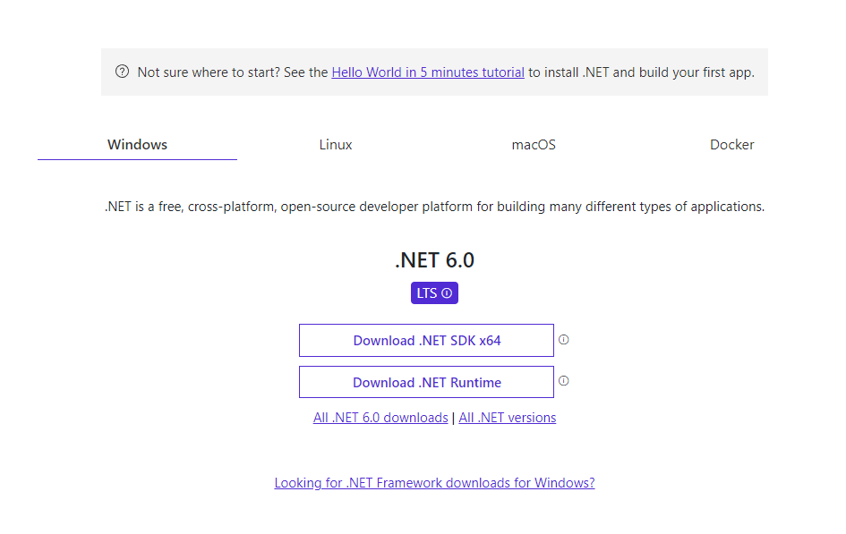
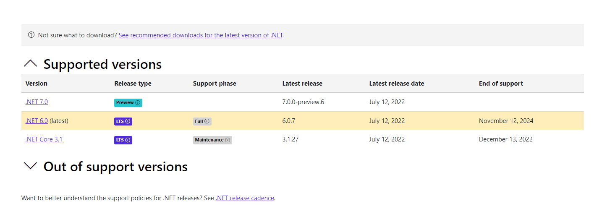
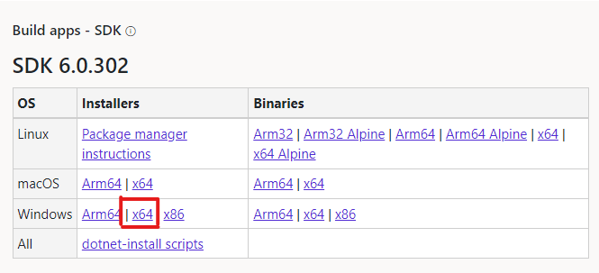
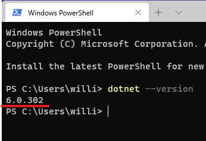
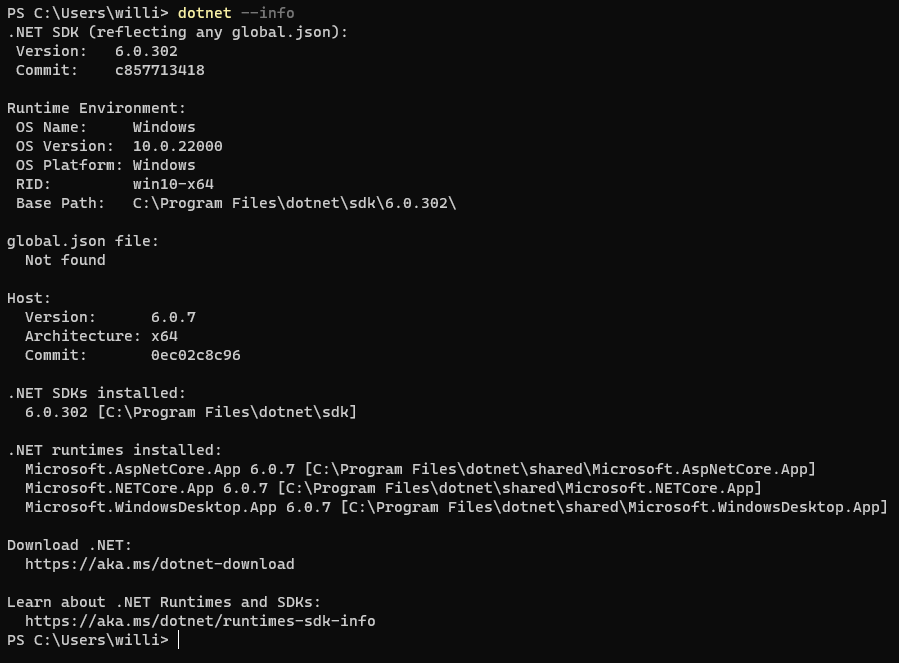
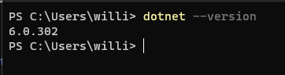
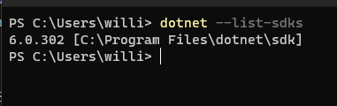
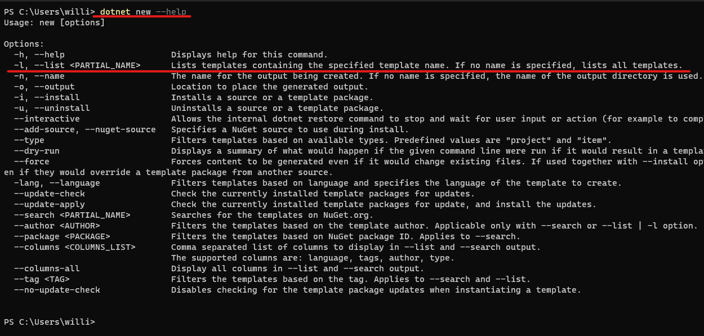

# Instalacao do SDK do .NET 6

Para instalar o .NET basta acessa o link [.NET SDK](https://dotnet.microsoft.com/en-us/download)

Nesta tela teremos a opcao de instalar o .NET em varios sistemas operacionais, como Windows, Mac, Linux.



Como estamos no windows, podemos clicar em Download .NET SDK x64, neste momento a versao disponivel para baixar e o .NET 6.

Mas nao vamos instalar dessa forma, vamos clicar no link [All .NET versions](https://dotnet.microsoft.com/en-us/download/dotnet). Nesta pagina podemos ver varias versoes do .NET, eh muito importante escolher a versao correta para iniciar nossas aplicacoes, o mais recomendado eh escolher as versoes LTS (Long-term support), versoes LTS tem o periodo suporte prolongado pela microsoft (03 anos).



Neste momento a versao LTS mais recente eh o .NET 6, vamos escolher este SDK (Software Development Kit) e fazer o download, a instalacao no windows eh simples, basta clicar no executavel e seguir o passo a passo da intalacao.



A instalacao no windows eh basicamente "next, next, finish", bem simples de se fazer. Depois que a instalacao for concluida vamos executar o seguinte comando no terminal:

```
dotnet --version
```

Depois de executado a seguinte saida eh esperada no terminal:



Bem simples nao?

Fizemos a instalacao do SDK do .NET em apenas alguns cliques, e agora podemos comecar a conhecer um pouco mais essa plataforma de desenvolvimento incrivel criada pela microsoft.

# DOTNET CLI

A dotnet CLI (Command line interface), eh uma ferramenta muito util que vai nos auxiliar no desenvolvimento de nossas aplicacoes, com ela podemos criar aplicacoes, executar, publicar aplicacoes dotnet, tudo isso por linha de comando.

A CLI do .NET ja esta incluida na instalacao do dotnet SDK.

# Principais comandos.

No inicio desse assunto ja executamos um comando, executamos o `dotnet --version`. Esse mostra a versao do SDK instalado na nossa maquina.

O comando dotnet basicamente tem duas funcoes:

1. Comandos para se trabalhar com dotnet
2. Executar aplicativos dotnet

## Exibindo informacoes do ambiente

```
dotnet info
```

Mostra as principais informacoes da instalacao atual do dotnet.

## 

```
dotnet --version
```

Mostra a versao do SDK.

## 

```
dotnet --list-sdks
```

Mostra todos os SDKs intalados na maquina.

## 

## Comandos Gerais

- `dotnet build` - Compila um projeto e todas as suas dependencias.
- `dotnet clean` - Limpa a saida de um projeto (Resultado de um dotnet build)
- `dotnet new` - Cria um novo projeto, arquivo de configuracao e etc. Alguns exemplos de projetos que podemos criar com este comando:

```
dotnet new console - Cria um novo projeto do tipo console.
dotnet new webapi - Criar um novo projeto do tipo API Web do ASP.NET Core
dotnet new gitignore - Cria um arquivo de configuracao do git para ignorar tipos de arquivos/diretorios e etc.
```

- `dotnet restore` - Restaura as dependencias de um determinado projeto.

- `dotnet run` - Executa um aplicativo dotnet.
- `dotnet test` - Executa os testes de um aplicativo dotnet.

Existem varios comandos da CLI que podemos executar para facilitar a criacao de projetos dotnet ou ate mesmo a publicacao. Muitos desses comandos tambem podem ser abstraidos por IDE`s (Ambiente de desenvolcimento integrado), que tambem nos auxiliam no desenvolvimento de aplicacoes.

Para qualquer comando que tivermos duvidas sobre quais parametros podem ser passados podemos sempre utilizar --help para obter mais informacoes e ajuda sobre o comando que estamos querendo executar, exemplo:

```
dotnet new  --help
```

O camando nos mostra todas as opcoes que temos para utilizar junto com o dotnet new e uma breve descricao sobre cada uma das opcoes.

## 
