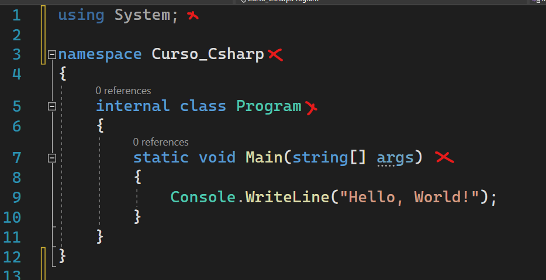
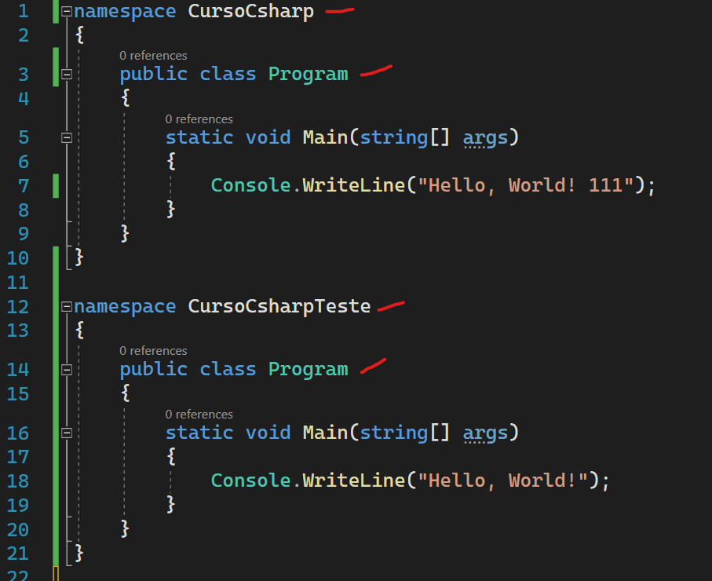
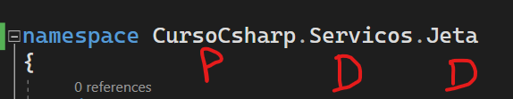
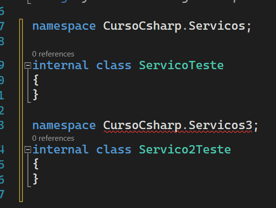

# Linguagem de programacao C# - Base da linguagem

## Escopo de um programa

Em um programa dotnet normalmente temos a seguinte estrutura dentro de um arquivo. (Antes da versao 6 do dotnet)

1. Importacoes (Usings)
2. Namespaces (Separacao logica)
3. Classes
4. Um metodo principal.

Quando estamos escrevendo nossos codigos, dificilmente vamos escrever tudo do zero, o intuito de utilizar um framework eh justamente esse, facilitar nossa vida com implementacoes que seriam triviais no desenvolvimento de uma aplicacao. Entao, quando precisamos por exemplo escrever alguma informacao no console (Telinha preta do windows), nao precisamos criar uma integracao do 0 com esse componente do windows, a aplicacao ja nos da o suporte para isso, para isso precisamos apenas fazer o import no namespace System e utilizar o metodo Console.WriteLine("Meu texto aqui"). Vamos entender ao longo do curso a utilizar usings para utilizar funcionalidades prontas na nossa aplicacao.

Namespaces nada mais eh do que uma separacao logica em nossa aplicacao, imagina que voce tenha a necessidade de ter duas classes com o mesmo nome dentro da aplicacao, sem o uso de namespaces isso nao seria possivel, uma vez que iria dar conflitos com os nomes iguais. Porem com o uso de namespaces podemos separa os contextos da nossa aplicacao em "diretorios virtuais", e com essa funcionalidade podemos ter dois arquivos com o mesmo nome separado em namespaces diferentes, muito bom nao acham? 

Vamos aprender o que realmente eh uma classe e sua importancia quando formos falar de orientacao a objetos, mas para nao deixar passar em branco, vamos simplificar a sua utilizacao. Uma classe nada mais eh do que um tipo de dados, como se fosse um int, string e etc. Mas diferentemente de um tipo int, uma classes possui estado e nenhum ou mais metodos para manipular seu estado.

E por fim temos o metodo principal, esse metodo eh a porta de entrada da nossa aplicacao, comumente chamamos esse metodo de SVM (static void main).
Basicamente toda aplicacao dotnet possui um metodo SVM.

## 

## Namespaces e usings

### Namespaces
Quando pensamos em organizar arquivos, logo pensamos em pastas, diretorios e etc. Essa forma de organizacao eh super valida quando estamos criando nossos programas em dotnet, mas tambem podemos utilizar de um recurso super importante que sao os namespaces. 

Os namespaces sao separacoes logicas, que permitem organizar melhor os nossos codigos. Com o uso de namespaces podemos ter varias classes com o mesmo nome (Nao que isso seja bom, mas podemos) em namepaces diferentes.

Veja no exemplo um mesmo arquico csharp com dois namespaces diferentes e dentro de cada namespace uma classe com o mesmo nome.

## 

Mas como se cria um namespace? Normalmente o nome do namespace segue a seguinte estrutura **"nome-projeto.diretorio-onde-se-encontra"**. 

## 
P - nome projeto | D - Nome diretorio na aplicacao.

Nas versoes anteriores ao dotnet 6, era-se obrigado a abrir e fechar chaves {} apos a definicao de um namespace. Nas versoes mais recentes (dotnet 6+) nao precisa mais criar esse tipo de estrutura, porem pode-se apenas definir um namespace por arquivo nessa nova estrutura. Essa nova forma de declaracao chama-se "file-scoped namespaces".

## 

Por convencao, o ideal eh ter apenas um namespace por arquivo. 

Um namespace nao limita-se a apenas um arquivo, posso ter dois arquivos com o mesmo namespace, isso eh muito comum inclusive. Quando formos contruir nossa aplicacoes vamos ver exemplos praticos da vida real com isso.

Lembra o using que vimos na sessao anterior? Quando utilizamos um using, estamos falando para a nossa classe que queremos utilizar as funcionalidades que temos dentro do namespace que declaramos.

Dentro no namespace "System" temos uma classe estatica chamada "Console" e dentro dessa classe temos um metodo estatico chamado WriteLine. Se nao utilizassemos o using na nossa classe teriamos que usar o metodo da seguinte forma: **System.Console.WriteLine("meu texto").**

### Usings

Para podemos utilizar alguns recursos do framework ou recursos que criamos nas nossas bibliotecas, temos que utilizar a palavra reservada using.

Por padrao o dotnet vem carregado com algumas funcionalidades e quando desejamos fazer uso de uma determinada funcionalidade ou recursos, utilizamos o using para que nossa aplicacao reconheca aquela funcionalidade.

Nas versoes anteriores ao dotnet 6 precisamos colocar varios usings semalhantes em quase todas as classes da nossa aplicacao, porem a partir do dotnet 6 foi implementado um recurso muito legal chamado "Global usings", onde para cada tipo de aplicacao/projeto sao importados de forma global varios namespaces que com certeza serao utilizados naquele projeto.

Normalmente as instrucoes usings sao declaradas no comeco do arquivo.

Podemos ver mais sobre global usings - [AQUI](https://docs.microsoft.com/en-us/dotnet/csharp/whats-new/csharp-10#global-using-directives)

## Palavras reservadas

Podemos escrever qualquer coisa nos nossos codigos desde que ele respeite as diretrizes da linguagem que estamos trabalhando, por exemplo: O C# ele eh case sensitive, isso significa que ele diferencia letra maiusculas de letras minusculas, vamos ver varios exemplos disso ao decorrer do treinamento.

Ou diretriz muito importantes sao as palavras reservadas da linguagem ou tambem conhecidas como keywords. As keyswords sao palavras que possuem um significado especifico para o compulador do C#. Por exemplo, nao posso declarar uma variavel com o nome de "int", porque int eh uma keyword que se refere a um tipo primitivo do C#, eu so poderia utilizar "int" se ele tivesse um prefixo "@" ou seja, "@if". Mas calma, nao precisamos decorar todas as keywords do C#, com o tempo as coisas ficam mais naturais e tambem a propria IDE nos auxilia nisso.

Podemos ver [AQUI](https://docs.microsoft.com/pt-br/dotnet/csharp/language-reference/keywords/) uma lista com as keywords do C#.

# Referencias

- [Documentacao Oficial .NET - Using ](https://docs.microsoft.com/pt-br/dotnet/csharp/language-reference/keywords/using-statement)
- [Documentacao Oficial .NET - Namespaces ](https://docs.microsoft.com/pt-br/dotnet/csharp/language-reference/keywords/namespace)
- [Documentacao Oficial .NET - Keywords ](https://docs.microsoft.com/pt-br/dotnet/csharp/language-reference/keywords/)